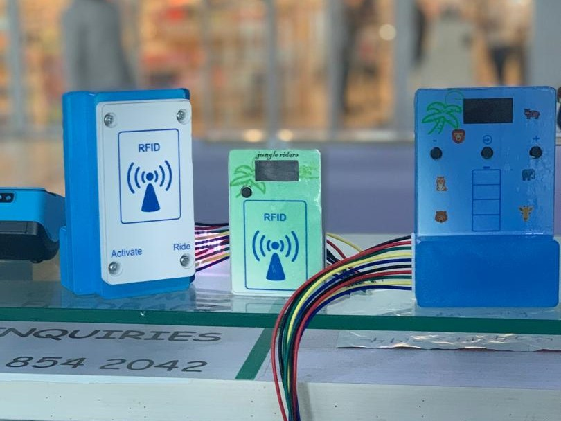

# Embedded Systems Projects

  

Welcome to **Cosmos**, a public repository showcasing my embedded systems and automation projects developed with Arduino-compatible platforms. These projects reflect my professional experience in designing robust, deployable solutions for real-world applications such as access control, wireless monitoring, secure data encoding, and automated control systems. Built with industry-standard technologies, they demonstrate my expertise in hardware-software integration, wireless communication, user interfaces, and fault-tolerant design—ideal for IoT, industrial automation, and secure systems.

With a background in technology management and hands-on embedded development, I've crafted these projects to mirror production-ready systems, drawing on skills developed through professional roles Cosmos Automation while adhering to all contractual obligations. Each project is documented to provide a clear view of my technical capabilities and problem-solving approach.

## 🛠 Project Overview

Below is a detailed breakdown of the projects in this repository. Each is designed for practical use cases, leveraging industry-standard hardware and software. This README will be updated as more projects are added.

### 1. iManager – Smart Irrigation Controller

**Description:**  
iManager is a smart irrigation controller developed to help farmers optimize water usage and improve crop yield. The project started as my final year university research, where it won **2nd Best Engineering Final Year Project in Nigeria (2019)**. It was later refined into “Nyammiri,” which won the **Farmers for the Future (BATNF) Grant (2021)**, and finally evolved into iManager — a robust, field-tested solution demonstrated in the greenhouse at **Enugu State University of Science and Technology, Faculty of Agriculture**.  

**Key Features:**  
- **Advanced Scheduling:** Supports up to 12 irrigation schedules per day with independent start/stop times.  
- **Multi-Zone Irrigation:** Controls up to 4 solenoid latch valves for different farm zones.  
- **Remote SMS Control:** Farmers can securely set, change, start, or stop irrigation using SMS commands, without needing internet access.  
- **GLCD Menu Interface:** Custom-designed GUI with icons for network bars, battery, pumps, timers, and moisture sensors, navigated via 5 physical buttons.  
- **Hydroponics Cycle Mode:** Allows periodic nutrient recirculation for hydroponic systems.  
- **Security:** Password-protected SMS commands to prevent unauthorized access.  
- **Power Efficiency:** Integrated battery charging circuit and energy-saving DC latch valves.  

**Technologies:**  
- **Hardware:** STM32 microcontroller, custom capacitive soil moisture sensor ([Design here](https://oshwlab.com/augustinenwafor1997/soil-moisture-sensor)), controller motherboard with integrated battery management and valve drivers ([Schematic here](https://oshwlab.com/agbarojipromiseug/imaneger-v1)).  
- **Firmware:** Written in C/C++ (Arduino STM32 Core), using libraries like U8g2 (GLCD graphics), STM32RTC, Chrono, and TimeLib.  
- **Communication:** GSM module for SMS messaging, password-authenticated parsing engine for remote commands.  

**Use Case:**  
Designed for rural farmers with limited internet access, iManager provides an accessible, affordable, and efficient way to manage irrigation across diverse crop zones. By combining local scheduling, soil moisture sensing, and remote SMS control, it reduces water waste, improves crop yields, and adapts to real-world farming challenges.  

**Source**: [iManager](iManagerV1)

➡️ [Read full project details »](iManagerV1/README.md)  

### 2. Access Control System (ACS) with QR Code Printer
**Description**: A comprehensive access control system for paid facilities (e.g., public restrooms), featuring a QR code printer for ticket generation and a main ACS controller for scanning, validation, and door control. Customers pay to receive a printed QR code ticket; the ACS scans it to grant timed entry via solenoid-locked doors, with logging and remote management via ESP8266.

**Key Features**:
- **QR Code Ticket Generation**: Securely encodes time-limited tokens (1-day validity) using parity-checked algorithms, generates QR codes, displays on OLED, and prints on thermal receipts.
- **QR Scanning & Decoding**: Reads QR codes via serial input, decodes interleaved tokens to extract UID, token, pair, and error data for validation.
- **Entry/Exit Controls**: Manages solenoid doors with door sensors, timed access (10s entry window), and LED/buzzer feedback (green for success, red for failure, amber for standby).
- **Data Logging & Retrieval**: Logs entries/exits to SD card with timestamps (RTC); supports date-range queries via ESP commands for report generation.
- **User Management**: ESP commands for activating/deactivating users (UID/owner pairs stored in CSV on SD); checks for valid, non-expired tokens.
- **Security & Reliability**: Failed entry alarms, door state monitoring, token log clearing, and persistent storage for robust operation.

**Technologies**:
- **Hardware**: Arduino/STM32 boards, thermal printer, SSD1306 OLED, solenoid locks, door switches, LEDs/buzzers, SD card module, DS3231 RTC, ESP8266 for remote commands, QR scanner.
- **Software**: Arduino IDE (C++), libraries: Adafruit_Thermal, U8g2, RTClib, SD, Wire, SoftwareSerial; custom QR generator/decoder and random number routines.
- **Communication**: Serial for QR scanner/ESP, I2C for RTC/OLED, SoftwareSerial for printer.
- **Use Case**: Secure, cashless access for public amenities like paid restrooms or parking, with audit trails and remote admin for operators.

**Source**: [ACS_MAIN](ACS_MAIN), [PRINTER_CODE](PRINTER_CODE)

### 3. Jungle Rider Timer System
**Description**: An RFID-based access control and timer system for vehicle or ride applications (e.g., rental ATVs or bikes). Users authenticate via RFID to activate a relay-controlled power output for a configurable duration, displayed in real-time on a seven-segment display. Includes a menu for runtime adjustments and battery monitoring.

**Key Features**:
- **RFID Authentication**: Securely activates sessions using MFRC522 RFID reader, with data stored on MIFARE cards.
- **Real-Time Countdown**: Displays MM:SS countdown on a seven-segment display with a blinking decimal point.
- **Persistent Storage**: Tracks usage counts and settings (time/voltage) in EEPROM for reliability across power cycles.
- **Battery Monitoring**: Maps analog voltage readings to LED indicators, alerting for low battery (8V–12V range).
- **User Interface**: Debounced buttons enable on-the-fly configuration of timer and voltage settings via a menu system.

**Technologies**:
- **Hardware**: STM32 microcontroller, MFRC522 RFID module, seven-segment display, relay, LEDs, RTC module.
- **Software**: Arduino IDE (C++), libraries: MFRC522, STM32RTC, Chrono, FlashStorage_STM32.
- **Communication**: SPI for RFID, direct GPIO for display and controls.
- **Use Case**: Ideal for ride-sharing or rental systems, ensuring secure access, precise timing, and equipment health monitoring.

**Source**: [JUNGLE_RIDER](JUNGLE_RIDER_TIMER_FK103M5_ZET6/JUNGLE_RIDER_TIMER_FK103M5_ZET6)

### 4. Power Monitor Modbus RTU
**Description**: A power quality monitoring system that reads three-phase voltage data via Modbus RTU and transmits status updates (high voltage, low voltage, phase imbalance, phase failure) wirelessly to a receiver using nRF24L01. Configurable via DIP switches for channel and address, it operates in time-slotted transmission to avoid collisions.

**Key Features**:
- **Modbus RTU Integration**: Reads voltage data from a Modbus device (e.g., energy meter) using holding registers for three-phase monitoring.
- **Power Quality Analysis**: Detects high voltage (>275V), low voltage (<180V), phase imbalance (>20V difference), and phase failure (<100V) with predefined thresholds.
- **Wireless Transmission**: Sends JSON-formatted status updates in 4-second time slots for up to 5 nodes, ensuring collision-free communication.
- **Configurable Setup**: DIP switches set node address (1–5) and channel for flexible network configuration.
- **Power Optimization**: Powers down radio between slots to conserve energy.

**Technologies**:
- **Hardware**: Arduino/STM32 board, nRF24L01 transceiver, Modbus RTU device, DIP switches.
- **Software**: Arduino IDE (C++), libraries: SimpleModbusMaster, RF24, ArduinoJson.
- **Communication**: Modbus RTU (serial, 8E1), SPI for radio, pull-down inputs for switches.
- **Use Case**: Industrial power monitoring for detecting voltage anomalies in three-phase systems, with wireless reporting for centralized dashboards.

**Source**: [PowerMornitor_Modbus_RTU](PowerMornitor_Modbus_RTU/PowerMornitor_Modbus_RTU)

### 5. Power Monitor Wireless Receiver
**Description**: A wireless receiver for monitoring up to five remote sensor nodes in a distributed system. It receives JSON-formatted status updates via nRF24L01 radio, visualizes node states (fault, data, voltage) on an LED dashboard using shift registers, and triggers alarms for errors or communication loss.

**Key Features**:
- **Multi-Node Monitoring**: Listens to five nRF24L01 pipes, each tied to a unique node address.
- **LED Dashboard**: Uses 74HC595 shift registers to control 24+ LEDs, displaying fault, data, and high-voltage states per node.
- **Persistent Node Tracking**: Stores active node IDs in EEPROM for configuration persistence.
- **Smart Alarms**: Triggers buzzer and LED after 30s of comm loss or 6 error checks; auto-clears when resolved.
- **Configurable Channels**: DIP switches set radio channels for flexible deployment.

**Technologies**:
- **Hardware**: Arduino board, nRF24L01 transceiver, 74HC595 shift registers, buzzer, DIP switches.
- **Software**: Arduino IDE (C++), libraries: RF24, ArduinoJson, ShiftRegister74HC595, EEPROM.
- **Communication**: SPI for radio, serial shift for LEDs, pull-down inputs for switches.
- **Use Case**: Industrial IoT for factory or environmental monitoring, detecting faults across distributed sensors.

**Source**: [Power Monitor_RX](PDMS_DISPLAY_RX)

### 6. Secure Token Encoder
**Description**: A utility for generating secure, parity-checked tokens from random seeds, designed for applications requiring error detection in data transmission (e.g., RFID or wireless protocols). Outputs structured char arrays combining UID, token, pair, and error codes.

**Key Features**:
- **Randomized Token Generation**: Uses rotated random numbers to create unique tokens, avoiding leading zeros.
- **Dynamic Parity**: Generates 1–14 bit parity values for robust error detection.
- **Compact Encoding**: Combines multiple fields (UID, token, pair, error) into a single char array for efficient transmission.
- **Lightweight Design**: No external hardware dependencies, runs on any Arduino board.

**Technologies**:
- **Hardware**: Any Arduino-compatible microcontroller.
- **Software**: Arduino IDE (C++), standard string and random utilities.
- **Communication**: None (standalone algorithm).
- **Use Case**: Enhances security in RFID or wireless systems by adding error-checked tokens to authentication.

**Source**: [Encode.ino](PRINTER_CODE/encode.ino)

### 7. QR Code Printer and OLED Display
**Description**: A system for generating and displaying QR codes on an OLED screen, with an option to print them using a thermal printer. Integrates with the Secure Token Encoder to create scannable tokens, used in the ACS project for ticketing.

**Key Features**:
- **QR Code Generation**: Converts encoded tokens (from `encode.ino`) into a 29x29 pixel QR code array.
- **OLED Visualization**: Renders QR codes on a 128x64 SSD1306 OLED display with pixel scaling for clarity.
- **Thermal Printing**: Prints QR codes via an Adafruit thermal printer triggered by a debounced button, with text indicating 1-day validity.
- **Efficient Integration**: Combines software serial for printer comms and I2C for OLED, minimizing pin usage.

**Technologies**:
- **Hardware**: Arduino board, SSD1306 OLED display, Adafruit thermal printer, push button.
- **Software**: Arduino IDE (C++), libraries: Adafruit_Thermal, U8g2, custom QR code generator, Button.
- **Communication**: SoftwareSerial for printer, I2C for OLED.
- **Use Case**: Ticketing systems for events or transportation, where QR codes provide secure, scannable access (core component of ACS).

**Source**: [PRINTER_CODE](PRINTER_CODE)

### 8. Elenktis Pump Controller
**Description**: An automated pump control system with manual and automatic modes, designed for dual-pump setups (e.g., water management). Uses a float switch to detect tank levels and alternates pumps hourly in auto mode to balance wear, with persistent mode storage.

**Key Features**:
- **Dual Modes**: Automatic (hourly pump alternation) and manual (user-selected pump) modes, toggled via buttons.
- **Level-Based Lockout**: Disables pumps when tank levels drop below setpoint (float switch), preventing dry running.
- **Persistent State**: Stores operating mode in EEPROM for consistency across power cycles.
- **Visual Feedback**: Indicator lights for each pump and auto mode, synchronized with pump states.
- **Real-Time Clock**: Uses STM32 RTC for precise hourly switching in automatic mode.

**Technologies**:
- **Hardware**: STM32 microcontroller, float switch, dual pumps, indicator LEDs, push buttons.
- **Software**: Arduino IDE (C++), libraries: STM32RTC, Chrono, EEPROM.
- **Communication**: Direct GPIO for inputs/outputs.
- **Use Case**: Water management systems for irrigation or industrial tanks, ensuring reliable pump operation.

**Source**: [ELENKTIS_MEMFYS_STM](ELENKTIS_MEMFYS)

## 💡 Technical Highlights
These projects showcase my ability to deliver production-grade embedded solutions:

- **Embedded Programming**: Proficient in C++ for Arduino/STM32, with state machines, interrupt handling, and precise timing (Chrono, RTC).
- **Hardware Integration**: Skilled in SPI, I2C, SoftwareSerial, Modbus RTU, GPIO multiplexing, shift registers, and relay/solenoid control.
- **Wireless & IoT**: Experienced with nRF24L01 for multi-node networks, JSON for structured data exchange, and ESP8266 for remote commands.
- **Reliability**: Implemented debouncing, EEPROM/SD persistence, error detection (parity, timeouts), and power optimization.
- **User Interfaces**: Designed intuitive displays (seven-segment, OLED, LED arrays), button-driven menus, and printed outputs.
- **Security**: Custom token encoding/decoding, time-bound access, user activation/deactivation, and logging for compliance.

The code is modular, well-commented, and optimized for scalability.

## 🚀 Getting Started
To explore or run these projects:
1. **Clone the Repo**:
   ```
   git clone https://github.com/augustinenwafor1997/cosmos-projects.git
   cd cosmos-projects
   ```
2. **Setup Arduino IDE**:
   - Install board support (e.g., STM32, Arduino via Board Manager).
   - Add libraries: MFRC522, RF24, ArduinoJson, ShiftRegister74HC595, STM32RTC, Chrono, FlashStorage_STM32, Adafruit_Thermal, U8g2, RTClib, SD, Button, SimpleModbusMaster.
3. **Wire Hardware**:
   - Refer to pin definitions in each `.ino` file (e.g., PA4 for RFID SS, PB0 for nRF24L01 CE, RX_PIN 5 for printer, entrySolenoid for doors, PB1 for Modbus TxEnable).
   - Schematics to be added for precise wiring.
4. **Upload & Test**:
   - Open a `.ino` file, select your board/port, and upload.
   - Monitor via Serial (9600 or 115200 baud) for debug insights.
5. **Issues?** File a GitHub issue or reach out (details below).

## Hardware Schematics & PCB

- **Automatic Irrigation Project**  
  [View Schematic & PCB](https://oshwlab.com/augustinenwafor1997/auto-irrigation-schematic)

- **Final Version of Irrigation Project (iManager)**  
  [View Schematic & PCB]( https://oshwlab.com/agbarojipromiseug/imaneger-v1)
  
- **Custom Soil Moisture Sensor**  
  [View Schematic & PCB](https://oshwlab.com/augustinenwafor1997/soil-moisture-sensor)

## 🔮 Future Plans
- Add schematics for each project.
- Include video demos showcasing hardware in action.
- Expand with projects like WiFi-enabled data logging or Bluetooth control.
- Optimize for lower power consumption in battery-driven setups.

## 🤝 Contributing
I welcome collaboration! Fork the repo, make enhancements, and submit a PR. Suggestions:
- Add cloud integration (e.g., MQTT for IoT dashboards).
- Port projects to other platforms (ESP32, Raspberry Pi).
- Develop mobile app interfaces for remote control.

## 👨‍💻 About Me
I'm **Augustine Nwafor**, an embedded systems engineer with professional experience in technology management and automation, including roles at Cosmos Automation. Currently pursuing an MSc in Computer Systems Technology (AI concentration) at LSUS, I'm seeking internship opportunities to apply my skills in innovative environments. These projects demonstrate my ability to build reliable, scalable systems for real-world applications.

- **LinkedIn**: [linkedin.com/in/augustinenwafor](https://www.linkedin.com/in/augustine-nwafor-7302a3195/) 
- **Email**: augustinenwaforn@gmail.com    

Star this repo if you find it useful! 🌟 I'm excited to discuss how my skills can contribute to your team.

---

*Last updated: September 17, 2025*  
