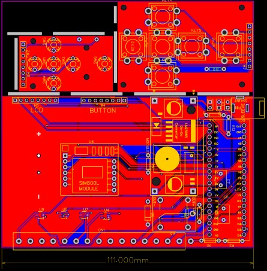
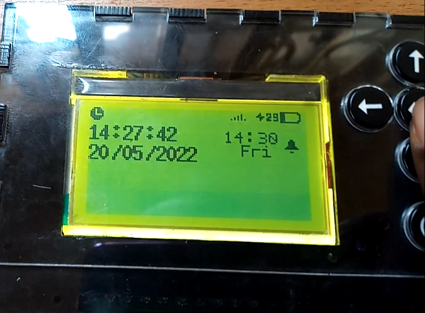
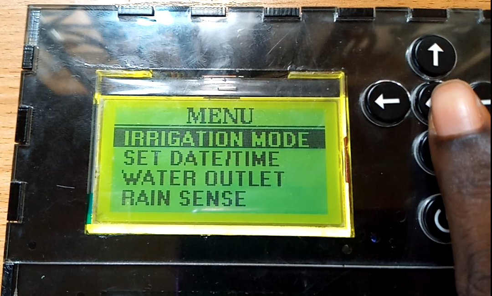
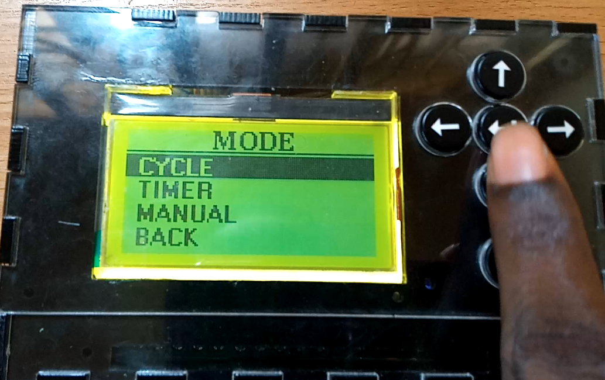
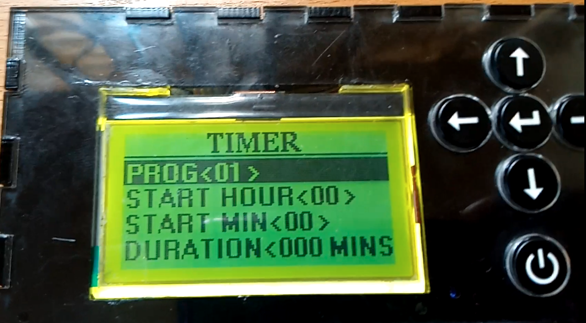

# iManager – Smart Irrigation Controller

## Overview
**iManager** is a smart irrigation controller I designed and implemented end-to-end. It began as my undergraduate final year project, where it won **2nd Best Engineering Final Year Project in Nigeria (2019)**, and later evolved into “Nyammiri,” which won the **Farmers for the Future Grant (BATNF, 2021)**. The final version was deployed and demonstrated at the **Enugu State University of Science and Technology, Faculty of Agriculture greenhouse**.

The system helps farmers save water and improve crop yield by combining soil moisture sensing, irrigation scheduling, and weather data integration. It is designed for real-world rural contexts where internet access is limited.

---

## Features
- **Irrigation Scheduling**
  - Up to 12 independent irrigation programs  
  - Multi-zone support (4 solenoid latch valves)  
  - Manual mode, timer mode, and cycle mode (hydroponics)

- **User Interface**
  - GLCD menu system with icons for network bars, battery, pumps, and more  
  - 5-button navigation with custom debouncing logic  
  - Custom-designed icons included in firmware  

- **Remote Control**
  - SMS-based command system (`set`, `change`, `start`, `stop`)  
  - Password-protected for secure farmer control  
  - Works without internet connectivity  

- **Hardware**
  - STM32 microcontroller core  
  - Custom capacitive soil moisture sensor ([Design here](https://oshwlab.com/augustinenwafor1997/soil-moisture-sensor))  
  - Motherboard with integrated battery charging and power distribution ([Schematic here](https://oshwlab.com/agbarojipromiseug/imaneger-v1))  
  - Energy-efficient DC latch solenoid valves  

---

## Firmware Highlights
- **Scheduling algorithm** for 12 irrigation slots, zone-aware  
- **GLCD graphics library integration** with custom icons (battery, network, pump, clock, alarms, etc.)  
- **Button control system** using a custom debounced input class  
- **SMS parsing & validation engine** with secure authentication  
- **Cycle mode** logic for hydroponics (nutrient recirculation)  

Code:
- [`iManager.ino`](./iManagerV1.ino) – Main firmware loop  
- [`declarations.h`](./declarations.h) – Global enums, variables, pin mappings  
- [`icons.h`](./icons.h) – Custom icons for the GLCD  
- [`menucontrols.h`](./menucontrols.h) – Menu logic and button handlers  

---

## Awards & Recognition
- 🥈 **2nd Best Engineering Final Year Project in Nigeria (2019)**  
- 🌱 **Farmers for the Future (BATNF) Grant (2021)**  

---

## Demonstration & Gallery

🎥 [Watch the full project walkthrough on YouTube](https://youtu.be/qzsObZuy2Qk)

### Images

  <table>
    <tr>
      <td align="center"> PCB Design</td>
      <td align="center"> Home Page</td>
      <td align="center"> Menu</td>
      <td align="center"> Mode</td>
      <td align="center"> Timer Mode</td>
    </tr>
  </table>

---

## Getting Started
### Hardware Setup
- Connect STM32 controller board to soil moisture sensor and up to 4 latch valves  
- Integrate GSM module for SMS control  
- Use 12V battery with charging system  

### Firmware Dependencies
- Arduino STM32 Core  
- U8g2lib (graphics library for GLCD)  
- STM32RTC  
- Chrono  
- TimeLib  

### Upload Instructions
1. Install STM32 core in Arduino IDE  
2. Add required libraries  
3. Upload `iManager_Sketch.ino` to the STM32 board  
4. Connect peripherals as per schematic links  

---

## Future Work
- Add LoRaWAN connectivity for extended range  
- Build a web dashboard for farmers with internet access  
- Add machine learning for adaptive irrigation control  

---
